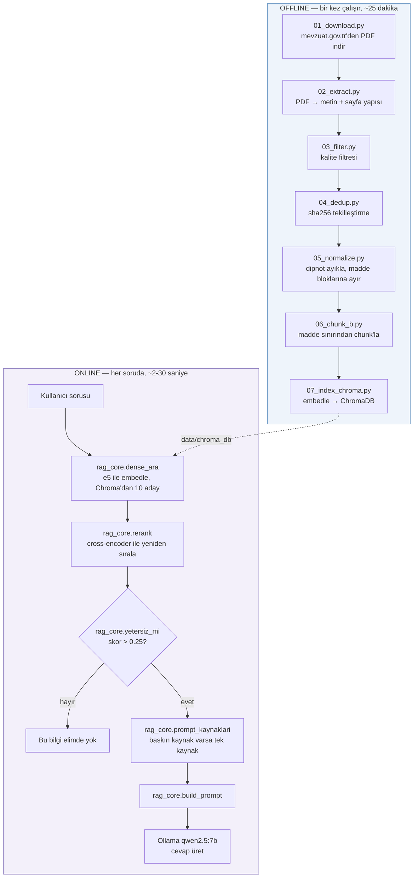
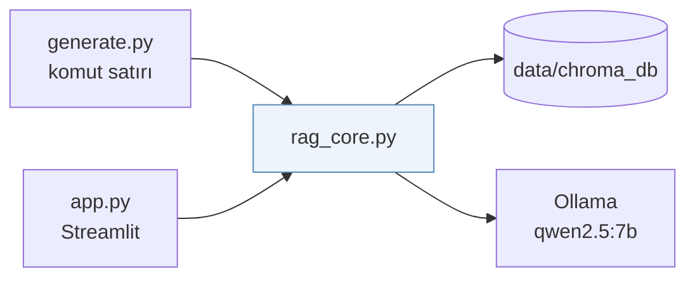
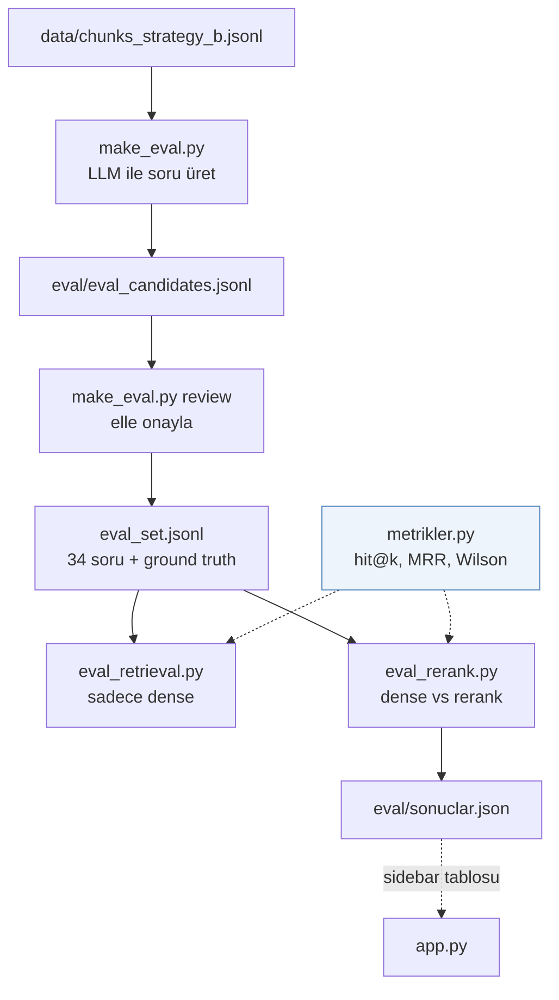

# Mimari — hangi dosya ne yapıyor

22 Python dosyası, 2574 satır. Bu belge her dosyanın **akıştaki yerini**,
**girdisini/çıktısını** ve **neden orada olduğunu** anlatır.

Kurulum ve çalıştırma komutları için [`README.md`](README.md),
mimari kararların ölçülmüş gerekçeleri için [`kararlar.md`](kararlar.md).

---

## 1. Sistem iki ayrı zamanda çalışır

RAG sistemlerini anlamanın anahtarı şu: kodun bir kısmı **önceden bir kez**
(offline), bir kısmı **her soruda** (online) çalışır.



**Kritik bağlantı:** offline tarafta `"passage: "`, online tarafta `"query: "`
öneki kullanılır. İkisi birebir eşleşmezse retrieval sessizce bozulur — bu
yüzden ikisi de `rag_core.py`'de tek sabit olarak tanımlıdır.

---

## 2. Dosya haritası

| Katman | Dosya | Satır | Rol |
|---|---|---|---|
| **Ortak** | `desenler.py` | 124 | Mevzuat metni düzenli ifadeleri (regex) |
| | `rag_core.py` | 264 | Retrieval + prompt + LLM çekirdeği |
| **Pipeline** | `pipeline/01_download.py` | 141 | PDF indirme |
| | `pipeline/02_extract.py` | 64 | PDF → metin |
| | `pipeline/03_filter.py` | 72 | Kalite filtresi |
| | `pipeline/04_dedup.py` | 44 | Tekilleştirme |
| | `pipeline/05_normalize.py` | 209 | Dipnot temizliği + blok ayırma |
| | `pipeline/06_chunk_a.py` | 87 | Strateji A (karşılaştırma) |
| | `pipeline/06_chunk_b.py` | 193 | Strateji B (kullanılan) |
| | `pipeline/07_index_chroma.py` | 133 | Embedding + indeksleme |
| **Sorgu** | `generate.py` | 77 | Komut satırı arayüzü |
| | `app.py` | 131 | Streamlit web arayüzü |
| **Eval** | `eval/make_eval.py` | 170 | Eval sorusu üretimi |
| | `eval/metrikler.py` | 76 | hit@k, MRR, güven aralığı |
| | `eval/eval_retrieval.py` | 87 | Sadece dense ölçüm |
| | `eval/eval_rerank.py` | 120 | Dense vs rerank karşılaştırma |
| **Debug** | `tools/debug_chunks.py` | 137 | Chunk kalitesi inceleme |
| | `tools/check_meta.py` | 51 | Chroma metadata bütünlüğü |
| | `tools/kalibre_esik.py` | 106 | Rerank eşiği kalibrasyonu |
| | `tools/aday_sayisi_tara.py` | 81 | N_CANDIDATES taraması |
| | `tools/karsilastir_index.py` | 93 | Eski/yeni indeks A/B testi |
| | `tools/migrate_eval_set.py` | 114 | Ground truth taşıma |

---

## 3. Ortak katman

Bu iki dosya akışta bir "adım" değil — diğer dosyaların ortak kullandığı
tanımları tutar. Var olma sebepleri aynı: **aynı bilginin iki yerde
kopyalanması ve sessizce ayrışması.**

### `desenler.py`

Mevzuat metnini tanımak için gereken tüm düzenli ifadeler.

| Tanım | Ne tanır |
|---|---|
| `YAPI_SATIR` / `YAPI_BLOK` | "BİRİNCİ BÖLÜM", "İKİNCİ KISIM" |
| `MADDE_SATIR` / `MADDE_ARA` | "Madde 141", "GEÇİCİ MADDE 4", "EK MADDE 2" |
| `madde_no_bul()` | Blok başından madde kimliği çıkarır: `"141"`, `"GEÇİCİ 4"` |
| `DIPNOT_NUMARA` + `DIPNOT_KANIT` | Sayfa altı dipnot satırı |
| `DEGISIKLIK_TABLOSU` | Kanun sonundaki değişiklik künyesi tablosu |
| `YAPISIK_HARF` / `YAPISIK_NOKT` | Gövdeye yapışmış üstsimge (`"hırsızlık66"`) |

> Bu desenler eskiden `05_normalize.py`, `06_chunk_b.py` ve
> `tools/debug_chunks.py` içinde üç ayrı kopyaydı. `debug_chunks.py`'nin
> başında *"chunk_b.py ile AYNI regex olmalı"* uyarısı vardı — o uyarıyı
> gerektiren durum ortadan kalktı.

**Kullananlar:** `05_normalize.py`, `06_chunk_b.py`, `tools/debug_chunks.py`

### `rag_core.py`

Sorgu zamanının tamamı. Model adları, E5 önekleri, Ollama parametreleri,
retrieval fonksiyonları ve prompt burada.

| Fonksiyon | Ne yapar |
|---|---|
| `yukle_sistem(cihaz)` | Embedding modeli + cross-encoder + Chroma koleksiyonu |
| `dense_ara(soru, ...)` | `"query: "` öneki ile embedle, Chroma'dan N aday çek |
| `rerank(soru, adaylar, ...)` | Cross-encoder ile yeniden sırala, `skor` alanı ekle |
| `retrieve(...)` | İkisini zincirler — normal kullanım bu |
| `yetersiz_mi(sonuclar)` | Top skor `RERANK_ESIK`'in altındaysa LLM'i hiç çağırma |
| `prompt_kaynaklari(...)` | Baskın kaynak varsa LLM'e sadece onu gönder |
| `build_prompt(...)` | İki adımlı (SEÇİM → CEVAP) prompt kurar |
| `generate` / `generate_stream` | Ollama çağrısı |

Ayarlanabilir sabitler ve ölçülmüş gerekçeleri:

| Sabit | Değer | Gerekçe |
|---|---|---|
| `N_CANDIDATES` | 10 | 10/20/30/50 tarandı; büyütmek hit@1'i değiştirmiyor, hit@5'i düşürüyor |
| `TOP_N` | 5 | LLM'e giden kaynak sayısı |
| `RERANK_ESIK` | 0.25 | Pozitif skor min 2.19, negatif max −1.68 — arada |
| `BASKIN_FARK` | 3.0 | 1. kaynak 2.'yi bu kadar geçerse tek kaynak gönder |
| `OLLAMA_SECENEKLERI` | `temperature=0.0`, `num_ctx=8192` | `num_ctx` verilmezse uzun prompt sessizce kırpılır |

**Kullananlar:** `generate.py`, `app.py`, `07_index_chroma.py`,
`eval_retrieval.py`, `eval_rerank.py`, `tools/` içindeki 4 script

---

## 4. Pipeline — korpusu indekse dönüştüren yedi adım

**Sıra zorunludur.** Her adım bir öncekinin dosyasını okur.

### `01_download.py` — PDF indirme

```
python pipeline/01_download.py index      # HF listesi  → mevzuat_index.jsonl
python pipeline/01_download.py download   # index       → data/raw/*.pdf
```

HuggingFace'teki mevzuat listesinden `(Tür, Tertip, No)` üçlülerini çıkarır;
PDF URL'i bu üçlüden sabit bir kalıpla üretilir. Arama API'si kurcalanmaz.

**Dikkat:** Site eksik ara sertifika sunduğu için `verify=False`, ve
tarayıcı User-Agent'ı olmadan sunucu gövde göndermiyor. Kalıp tutmazsa
HTML hata sayfası dönebildiği için `%PDF` byte kontrolü var.

### `02_extract.py` — PDF → metin

```
data/raw/*.pdf  →  data/text/*.txt       (düz metin)
                →  data/pages/*.jsonl    (SAYFA SAYFA)
                →  extract_stats.jsonl   (sayfa/karakter sayıları)
```

pdfplumber ile metin çıkarır. **İki çıktı üretmesinin sebebi kritik:**
mevzuat PDF'lerinde dipnotlar sayfanın altındadır. Sayfalar düz metinde
birleştirilince dipnotlar gövdenin ortasına düşer ve onları ayırmak
imkânsızlaşır. `data/pages/` sayfa sınırını korur; `05_normalize.py` bunu
kullanır.

### `03_filter.py` — kalite filtresi

```
mevzuat_index.jsonl + extract_stats.jsonl  →  corpus_manifest.jsonl
```

Min 3000 karakter, min 200 karakter/sayfa. Taranmış (OCR gerektiren) PDF'leri
karakter/sayfa oranından yakalar. 298 aday → 279 kabul.

**Dikkat:** Manifest'i sıfırdan yazar, `04_dedup.py`'nin eklediği duplicate
işaretlerini siler. Script bunu tespit edip uyarır.

### `04_dedup.py` — tekilleştirme

```
corpus_manifest.jsonl  →  corpus_manifest.jsonl (yerinde, sha256 + duplicate eklenir)
```

Normalize edilmiş metnin sha256'sı ile birebir kopyaları işaretler.
Bu korpusta 0 duplike çıktı.

### `05_normalize.py` — dipnot temizliği + blok ayırma

```
data/pages/*.jsonl + corpus_manifest.jsonl  →  data/norm/*.txt
```

Pipeline'ın **en çok iş yapan** adımı. İki görevi var:

**1. Dipnot ayıklama.** Kural: *bir sayfada dipnot başladıysa o sayfanın
kalanı dipnottur.* Satır deseninden "dipnot nerede biter" tahmin etmek
denendi ve gövde metnini de siliyordu — yapı kullanmak tahminden güvenli.
Güvenlik supabı: kesimden sonra madde/bölüm başlığı kalıyorsa o aday
yanlıştır, bir sonrakine geçilir.

Ayrıca kanun sonundaki değişiklik tablosu kesilir ve gövdeye yapışmış
üstsimge dipnot numaraları (`"cezalandırılır.37"`) temizlenir.

**2. Blok ayırma.** `birlestir()` fonksiyonu PDF'ten gelen satır kırıklarını
birleştirip her maddeyi kendi bloğuna koyar; madde başlığını maddenin önüne
ekler (`"Hırsızlık Madde 141- ..."`). Bloklar `\n\n` ile ayrılır.

> Satır içi `(Değişik: ...)` / `(Mülga: ...)` ibareleri **bilinçli olarak
> silinmez** — "(Mülga)" hükmün yürürlükten kalktığını söyler, atılırsa
> sistem kalkmış bir hükmü yürürlükteymiş gibi sunar.

### `06_chunk_a.py` — strateji A (sadece karşılaştırma)

```
data/norm/*.txt  →  data/chunks_strategy_a.jsonl
```

Sabit 800 karakter pencere, 100 karakter overlap. Madde sınırını hiç
dikkate almaz. **İndekslenmez** — B'nin neden daha iyi olduğunu
gösterebilmek için duruyor.

### `06_chunk_b.py` — strateji B (kullanılan)

```
data/norm/*.txt  →  data/chunks_strategy_b.jsonl   (18083 chunk)
```

Madde sınırından chunk'lar. Üç garantisi var:

1. **Bir chunk en fazla bir madde başlığı içerir.** Kısa maddeler bir
   sonrakiyle birleştirilmez. 87 karakterlik doğru bir chunk, iki maddeyi
   karıştıran 912 karakterlik bir chunk'tan iyidir.
2. **Hiçbir chunk `MAX_CHUNK`'ı (1200) aşmaz** — tek çıkış noktası
   `close_tampon()`, her chunk oradan geçer.
3. **Uzun maddeler cümle sınırından bölünür**, kelime ortasından değil.

Her chunk'ın alanları: `chunk_id`, `doc_id`, `text`, `char_len`, `madde_no`.
`madde_no` madde **türünü korur**: `"141"`, `"GEÇİCİ 4"`, `"EK 2"` — çünkü
bir kanunda `Madde 4`, `Ek Madde 4` ve `Geçici Madde 4` aynı anda bulunabilir.

### `07_index_chroma.py` — embedding + indeksleme

```
chunks_strategy_b.jsonl + corpus_manifest.jsonl  →  data/chroma_db/
```

Her chunk'ı `"passage: "` önekiyle embedler (384 boyut) ve ChromaDB'ye yazar.
Metadata: `doc_id`, `madde_no`, `baslik`, `char_len`.

**Dikkat:** Koleksiyonu her koşuda sıfırlar (incremental güncelleme yok).
Embedding batch'i 32 — CPU'da 256 daha yavaş, çünkü her batch içindeki en
uzun diziye kadar padding'lenir. Tüm metinler tek `encode()` çağrısında
verilir ki sentence-transformers uzunluk sıralamasını korpus genelinde yapsın.

---

## 5. Sorgu zamanı — iki arayüz, tek çekirdek



### `generate.py`

```bash
python generate.py "hırsızlığın cezası nedir"
python generate.py                              # gömülü test soruları
```

Komut satırı arayüzü. Cevabı, kullanılan kaynakları (rerank skorlarıyla) ve
retrieval/generation sürelerini basar. Argümansız çalıştırıldığında 6 test
sorusu koşar — ikisi bilinen hatalı vakalar (TCK 141/144, TCK 81/85), biri
negatif test.

### `app.py`

```bash
streamlit run app.py
```

Web arayüzü. `generate.py` ile **aynı** `rag_core` fonksiyonlarını kullanır.
Farkları: cevabı akış hâlinde gösterir (`generate_stream`), embedding ve
rerank'i CPU'ya sabitler (4GB VRAM'in tamamı LLM'e kalsın), ve sidebar'daki
başarım tablosunu `eval/sonuclar.json`'dan okur.

> Bu ikisi eskiden retrieval ve prompt kodunun ayrı kopyalarını taşıyordu ve
> sessizce ayrışmışlardı: E5 sorgu öneki, `TOP_N` ve prompt talimatı farklıydı.
> Hangi kod yolunda ölçüm yapıldığı belirsizdi.

---

## 6. Eval katmanı



### `eval/make_eval.py`

Chunk'ları LLM'e gösterip her birinden bir soru yazdırır, sonra siz elle
onaylarsınız (`e`/`h`/`d`/`q`). Ground truth otomatik gelir: sorunun
üretildiği chunk'ın `doc_id` + `madde_no`'su.

**İki bilinen yanlılığı var, sunumda kendiniz söyleyin:**
- **Seçim yanlılığı:** `KOTU_DESENLER` filtresi uygun chunk'ların %12.3'ünü
  eliyor. Ölçülen hit@k korpusun temiz %88'inde geçerli — bir üst sınır.
  `--filtresiz` bayrağı ile kapatıp farkı ölçebilirsiniz.
- **Leakage:** Sorular, cevabı içeren chunk gösterilerek üretiliyor. Gerçek
  kullanıcı soruları böyle davranmaz. Telafi: 10-15 soruyu elle yazıp ayrı
  raporlamak.

### `eval/metrikler.py`

Ortak metrik fonksiyonları. **İki düzeyde ölçüm** yapar:

| Düzey | Eşleşme | Anlamı |
|---|---|---|
| Madde düzeyi (gevşek) | `doc_id` + `madde_no` | "Doğru maddeyi bulduk mu" |
| Chunk düzeyi (katı) | `chunk_id` birebir | "Doğru parçayı bulduk mu" |

İkisi birden raporlanır çünkü 34 sorunun 24'ünde ground truth birden fazla
chunk ile eşleşiyor (uzun maddeler parçalara bölünüyor). `wilson_alt_sinir()`
de burada: 34 soruda "%100" demek yanıltıcı, alt sınır ~%90.

### `eval/eval_retrieval.py` ve `eval/eval_rerank.py`

Birincisi sadece dense retrieval'ı ölçer. İkincisi dense ile
dense+rerank'i yan yana koyar ve `eval/sonuclar.json`'a yazar.

> **Metodoloji notu:** Rerank aynı 10 adayı yeniden sıralar, havuza aday
> eklemez. Dolayısıyla rerank hit@10, dense hit@10'a **tanım gereği**
> eşittir — dense hit@10 reranker'ın tavanıdır. Tabloda eşit çıkması hata
> değil.

---

## 7. Debug ve analiz araçları

Bunlar akışın parçası değil; bir şeyi ölçmek veya doğrulamak istediğinizde
çalıştırılır.

| Script | Ne zaman kullanılır |
|---|---|
| `tools/debug_chunks.py` | Chunking'i değiştirdikten sonra. `kirlilik` komutu dipnot sızıntısını ve çoklu-madde ihlalini ölçer — chunking sözleşmesinin testi budur |
| `tools/check_meta.py` | İndeksleme sonrası. Boş `baslik` sayısı 0 olmalı; boşsa prompt'ta `[1] , Madde 141` gibi kimliksiz etiket oluşur |
| `tools/kalibre_esik.py` | `RERANK_ESIK` belirlemek için. Pozitif ve negatif soruların skor dağılımını çıkarır |
| `tools/aday_sayisi_tara.py` | `N_CANDIDATES` seçimini gerekçelendirmek için. Rerank'in tavanını gösterir |
| `tools/karsilastir_index.py` | Chunking değişikliğinin retrieval'a etkisini ölçmek için. Eski indeksi yedekten okuyup A/B yapar |
| `tools/migrate_eval_set.py` | Chunking değişince ground truth'u taşımak için. `chunk_id`'ler kayar, eski etiketle ölçüm sessizce yanlış sonuç verir |

> `karsilastir_index.py` ve `migrate_eval_set.py`, `../rag-mevzuat-yedek/`
> altındaki yedeği okur. Chunking'i değiştirmeden önce `data/chroma_db`,
> `data/chunks_strategy_b.jsonl` ve `eval_set.jsonl` yedeklenmezse bu
> karşılaştırmalar yapılamaz.

---

## 8. Modül bağımlılıkları

```mermaid
flowchart TB
    DES["desenler.py"]
    RC["rag_core.py"]
    MET["eval/metrikler.py"]

    DES --> N5["05_normalize.py"]
    DES --> C6["06_chunk_b.py"]
    DES --> DC["tools/debug_chunks.py"]

    RC --> IX["07_index_chroma.py"]
    RC --> GEN["generate.py"]
    RC --> APP["app.py"]
    RC --> ER["eval/eval_retrieval.py"]
    RC --> ERR["eval/eval_rerank.py"]
    RC --> T1["tools/kalibre_esik.py"]
    RC --> T2["tools/karsilastir_index.py"]
    RC --> T3["tools/aday_sayisi_tara.py"]
    RC --> T4["tools/check_meta.py"]

    MET --> ER
    MET --> ERR
    MET --> T2
    MET --> T3

    style DES fill:#eef4fb,stroke:#5588bb
    style RC fill:#eef4fb,stroke:#5588bb
    style MET fill:#eef4fb,stroke:#5588bb
```



`pipeline/`, `eval/` ve `tools/` altındaki scriptler kök dizindeki modülleri
şu kalıpla import eder:

```python
KOK = Path(__file__).parent.parent
sys.path.insert(0, str(KOK))
from desenler import madde_no_bul
```

Bütün scriptler yollarını `Path(__file__)`'dan hesaplar — hangi dizinden
çalıştırıldığından bağımsız olarak doğru dosyayı bulurlar.

---

## 9. Neyi değiştirirsem neyi yeniden çalıştırmalıyım

| Değiştirdiğim | Yeniden çalıştırmam gereken |
|---|---|
| `desenler.py` dipnot desenleri | `05` → `06_chunk_b` → `07` → eval |
| `06_chunk_b.py` chunking mantığı | `06_chunk_b` → `migrate_eval_set` → `07` → eval |
| `rag_core.py` prompt / `TOP_N` / eşikler | Hiçbiri — sadece sorgu zamanını etkiler |
| `rag_core.py` `EMBED_MODEL` veya önekler | `07` → eval (indeks geçersizleşir) |
| `03_filter.py` eşikleri | `03` → `04` → `05` → `06` → `07` → eval |

> **Chunking'i değiştirdiyseniz `migrate_eval_set.py`'yi atlamayın.**
> `chunk_id`'ler kayar ve `madde_no` formatı değişebilir; eski ground
> truth'la ölçüm hata vermez, sessizce yanlış sonuç üretir.

---

## 10. Açık sorunlar

| Sorun | Durum |
|---|---|
| Incremental indeksleme yok | `chunk_id` doküman içi sıraya bağlı; gerçek incremental için içerik bağlantılı id gerekiyor |
| BM25/hybrid yok | Türkçe sondan eklemeli, gövdeleme + RRF füzyonu gerekiyor |
| Generation eval'i yok | Prompt artık `(Kanun adı, Madde X)` atfı istiyor — cevaptan regex'le çekip ground truth ile karşılaştırmak bunu ucuza çözer |
| Reranker temel hüküm yerine nitelikli hâli seçiyor | `mmarco` Türkçe hukukla eğitilmedi. "Hırsızlığın cezası" → TCK 144 (doğru: 141), "adam öldürme" → TCK 85 (doğru: 81) |
